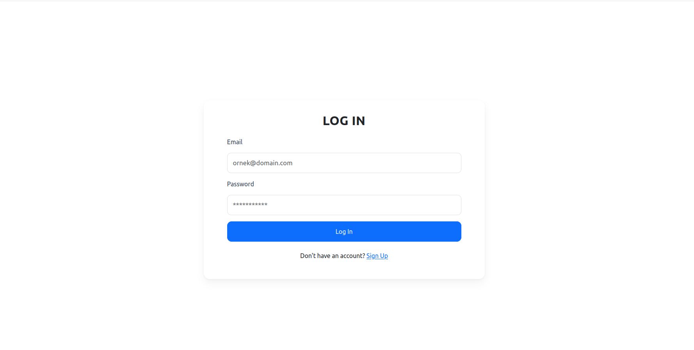
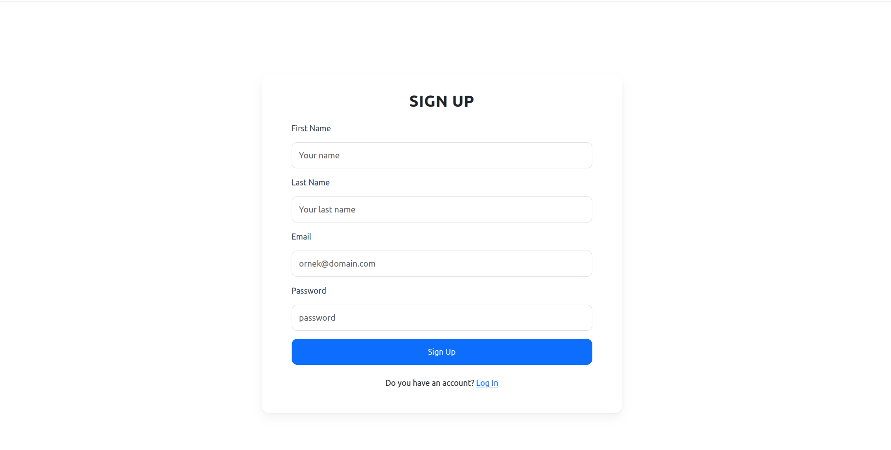
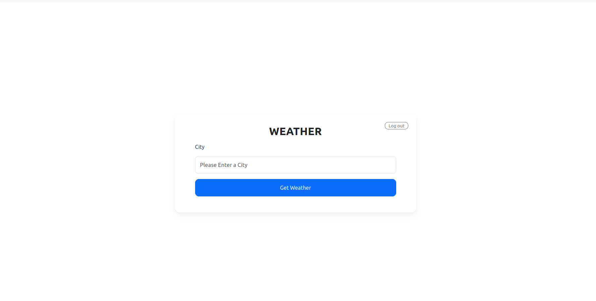
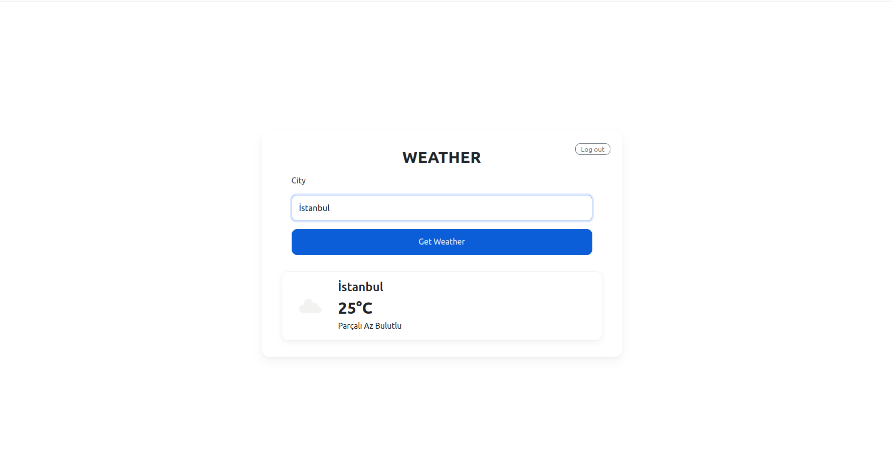

🌤️ Weather App

Bu proje JavaScript, HTML ve CSS ile geliştirilmiş basit bir Kayıt → Giriş → Hava Durumu uygulamasıdır.
Kullanıcı önce kayıt olur, giriş yapar, ardından şehir yazarak OpenWeather üzerinden anlık hava durumunu görüntüler. Giriş sonrası token localStorage’da saklanır; Log out ile temizlenir.

🚀 Canlı Demo

👉 [Projeyi buradan çalıştır](https://busraygul.github.io/weather-app/)

Log In:
email: eve.holt@reqres.in
password: cityslicka

🛠️ Kullanılan Teknolojiler

HTML5

CSS3

Bootstrap 5

JavaScript (ES6+)

Reqres

Uygulama Görselleri

▶️ Kullanım

Sign Up: Email + password ile kayıt ol (başarı/hatayı görürsün).

Log In: Email + password ile giriş yap; başarılıysa weather.html’e yönlendirilirsin.

Weather: Şehir adını gir → Get Weather → sıcaklık, açıklama, ikon gösterilir.

Log out: Sağ üst → token temizlenir → login sayfasına dönersin.

👩‍💻 Geliştirici

[GitHub Profilim](https://github.com/busraygul)
